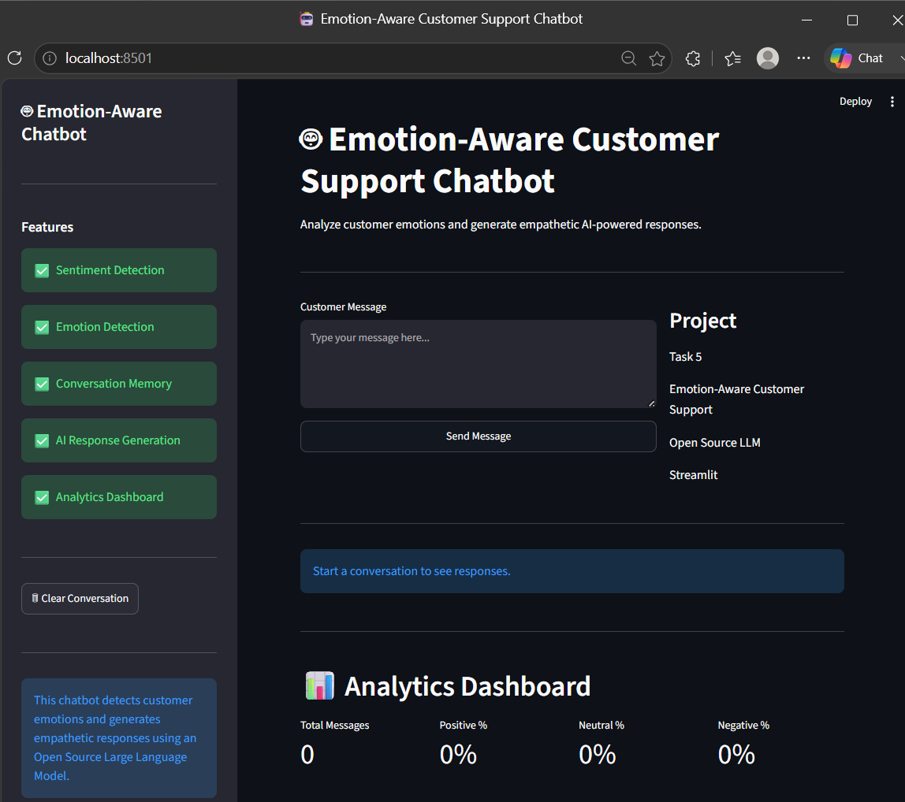
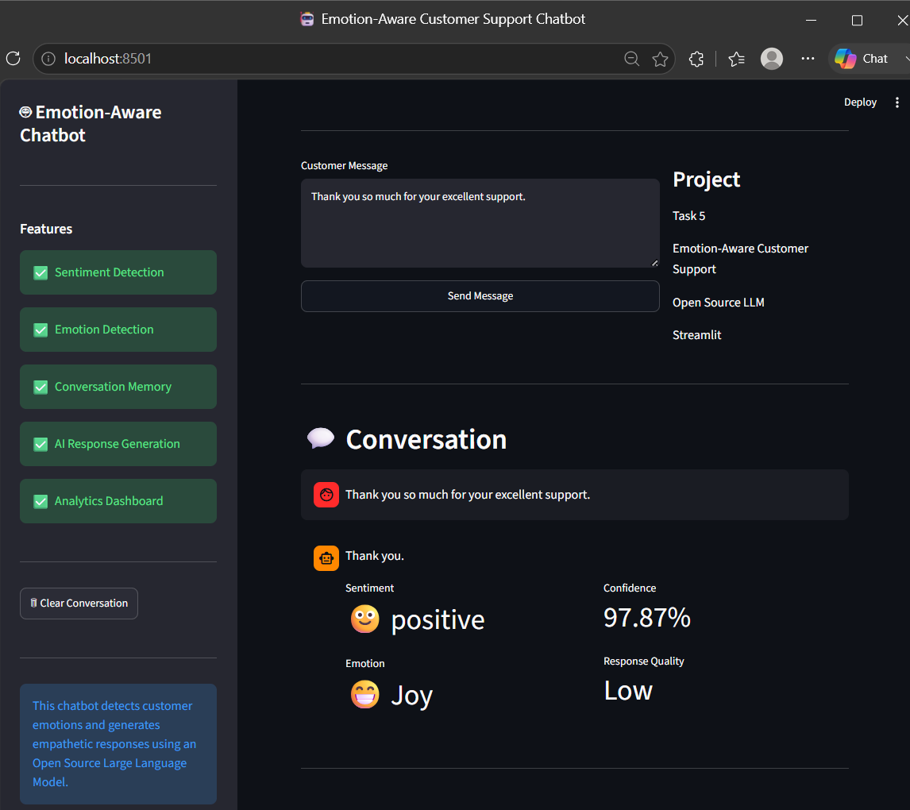
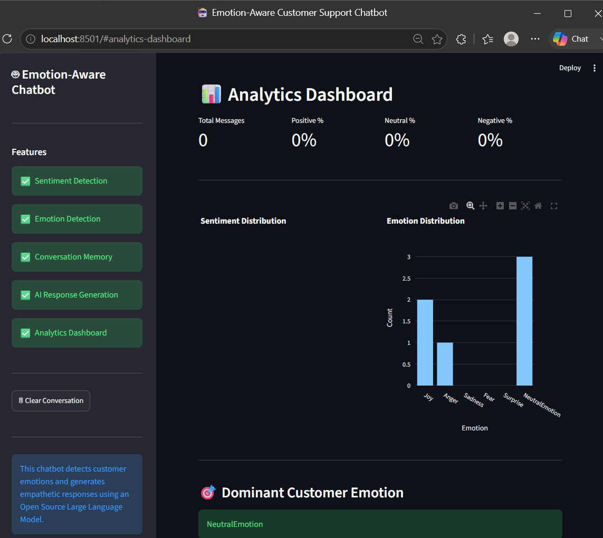

# 🤖 Emotion-Aware Customer Support Chatbot

> An AI-powered customer support chatbot capable of detecting user sentiment and emotions, generating empathetic responses using an open-source Large Language Model (LLM), maintaining conversation history, and providing real-time analytics through an interactive Streamlit interface.


---

# 📌 Project Overview

This project was developed as **Task 5** of the **ElevanceSkills Data Science Internship**.

The chatbot enhances traditional customer support systems by incorporating **Sentiment Analysis** and **Emotion Detection** to understand customer emotions and generate context-aware, empathetic responses.

Unlike conventional chatbots, this system analyzes customer emotions before generating responses, leading to more personalized and human-like interactions.

---

# 🎯 Objectives

- Detect customer sentiment (Positive, Neutral, Negative)
- Identify customer emotions
- Generate empathetic AI responses
- Maintain conversation history
- Display real-time sentiment analytics
- Improve customer interaction experience
- Demonstrate practical NLP implementation using open-source models

---

# ✨ Features

- 😊 Sentiment Analysis
- ❤️ Emotion Detection
- 🤖 AI Response Generation
- 🧠 Conversation Memory
- 📈 Real-Time Analytics Dashboard
- 📊 Sentiment Distribution Charts
- 😀 Emotion Distribution Charts
- 🎯 Confidence Score Display
- 💬 Conversation History
- 🧹 Reset Conversation
- 📱 Interactive Streamlit Interface

---

# 🛠 Technologies Used

- Python
- Streamlit
- Hugging Face Transformers
- FLAN-T5
- RoBERTa
- Plotly
- Scikit-learn
- Pandas
- PyTorch

---

# 🧠 AI Models Used

## Sentiment Analysis

Model:

```
cardiffnlp/twitter-roberta-base-sentiment-latest
```

Used for:

- Positive Detection
- Neutral Detection
- Negative Detection

---

## Response Generation

Model:

```
google/flan-t5-base
```

Used for:

- Empathetic AI Responses
- Context-aware Replies
- Customer Support Assistance

---

# 📂 Project Structure

```
Sentiment_Aware_Chatbot
│
├── app5.py
├── requirements.txt
├── README.md
│
├── assets
│
├── data
│
├── models
│
└── src
    ├── analytics.py
    ├── chatbot.py
    ├── memory.py
    ├── prompts.py
    ├── response_generator.py
    ├── sentiment.py
    ├── utils.py
    ├── validator.py
    └── __init__.py
```

---

# 🚀 Installation

Clone the repository

```bash
git clone https://github.com/YOUR_USERNAME/Emotion-Aware-Customer-Support-Chatbot.git
```

Move into the project folder

```bash
cd Emotion-Aware-Customer-Support-Chatbot
```

Install dependencies

```bash
pip install -r requirements.txt
```

Run the application

```bash
streamlit run app5.py
```

---

# 💬 Example Interaction

### Customer

```
I'm really frustrated because my order hasn't arrived.
```

### Detected Sentiment

```
Negative 😞
```

### Detected Emotion

```
Anger 😡
```

### AI Response

```
I'm sorry to hear that your order has not arrived yet.
I understand how frustrating this situation can be.
Let me help you resolve this issue as quickly as possible.
```

---

# 📊 Analytics Dashboard

The chatbot automatically generates:

- Total Messages
- Positive Percentage
- Neutral Percentage
- Negative Percentage
- Sentiment Distribution
- Emotion Distribution
- Dominant Customer Emotion

---

# 📸 Application Screenshots

## Home Page





---

## Chat Interface



---

## Analytics Dashboard



```

# 🎯 Internship Task

**ElevanceSkills Data Science Internship**

### Task 5

Develop a chatbot that integrates sentiment analysis to detect and respond appropriately to customer emotions during interactions.

---

# ✅ Expected Outcome

✔ Accurate Sentiment Detection

✔ Emotion Recognition

✔ AI-Powered Empathetic Responses

✔ Improved Customer Satisfaction

✔ Interactive Analytics Dashboard

✔ Open Source LLM Integration

---

# 📈 Future Enhancements

- Voice-based Customer Support
- Multilingual Support
- Live Database Integration
- User Authentication
- Fine-tuned Customer Support LLM
- RAG-based Knowledge Integration
- Speech Emotion Recognition
- Customer Satisfaction Prediction

---

# 👨‍💻 Author

**Sankeerth M**

B.Tech - Electronics and Communication Engineering

Machine Learning | Generative AI | NLP | Python Developer

---

# 📜 License

This project is developed for educational and internship purposes.

Feel free to use and enhance this project with proper attribution.

---

# ⭐ Acknowledgements

- ElevanceSkills
- Hugging Face
- Streamlit
- Cardiff NLP
- Google Research
- PyTorch
- Scikit-learn
